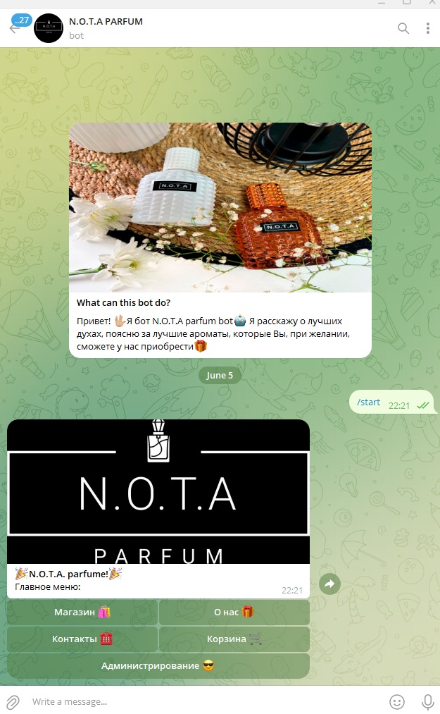
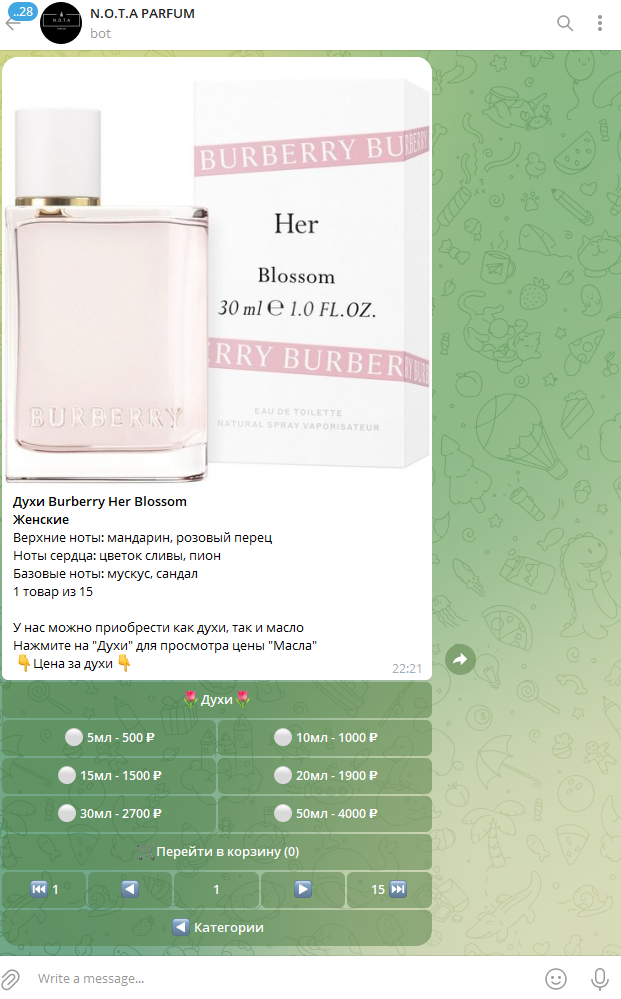
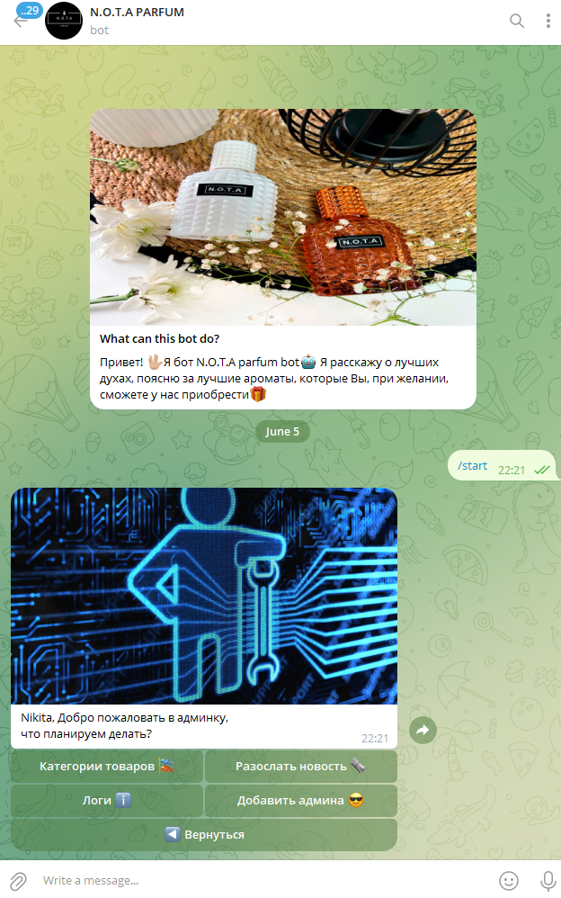

# Телеграмм бот - магазин парфюма 🤖
    
## Стэк
```
aiogram v3.3.0
aiogram-dialog v2.1.0
beautifulsoup4 v4.12.3
selenium v4.21.0
undetected-chromedriver v3.5.5
SQLAlchemy v2.0.27
```

____
# Пояснения к стэку
Бот создан по архитектуре aiogram-dialog, для бд использовалась библиотека SQLAlchemy, СУБД - postgersql.
Beautifulsoup4, selenium, undetected-chromedriver задействованы для парсинга сайта Почта России.
____
## Функционал бота
Бот предназначен для продажи парфюмерии. Он имеет пользовательскую часть, которая включает сам магазин,
корзину с товаром, информацию о магазине, контакты. Также он имеет и админскую часть, которая включает
в себя создание/удаление/редактирование продуктов и категорий товара, рассылку сообщений, просмотр логов,
просмотр/создание администраторов.

____
## Пример работы бота
```
При запуске бота перед нами открывается диалог, в котором пользователь/админ и будет взаимодействовать с ботом.
Клавиша "Администрирование" доступна только администраторам.
```


```
Для реализации карточки товара использовались следующие виджеты aiogram-dialog:
- Multiselect - для выбора объема и цены товара
- Checkbox - для выбора категории (духи/масло)
- StubScroll - для пагинации
```

```
В панеле администратора мы получаем возможность изменить/добавить/редактировать категории товаров,
сами товары, разослать новость всем пользователям бота, просмотреть логи о регистрации пользователей и
об их покупках, а также добавить/просмотреть администраторов.
```


```
При осуществлении покупки товара, все администраторы автоматически получают сообщение о том, что пользователь осуществил
покупку определенных товаров, адрес, куда необходимо выслать товар и контактный телефон покупателя. Данная информация
также дублируется в лог файл.
```

Документация о aiogram-dialog: https://aiogram-dialog.readthedocs.io/en/stable/ 

